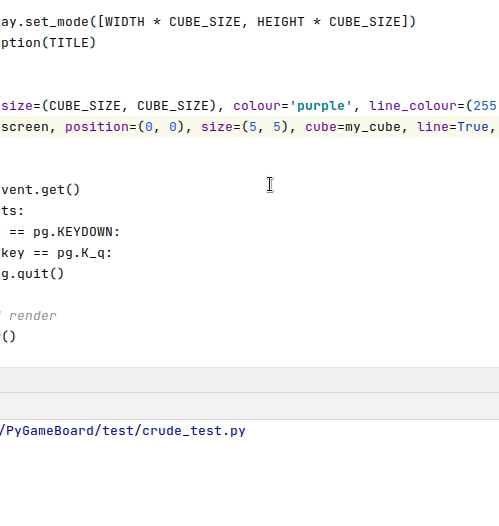

## pygame-board
Making drawing board-oriented stuff a bit easier.

## usage:

<pre><code>
import pygame as pg
from pygame_board import Board, MyRect

<b># set size of board which is measured in cubes</b>.

BOARD_HEIGHT = 5 # five cubes high
BOARD_WIDTH = 5 # five cubes wide
CUBE_WIDTH = 100

<b># init pygame:</b>

pg.display.init()
screen = pg.display.set_mode([BOARD_WIDTH*CUBE_WIDTH, BOARD_HEIGHT*CUBE_WIDTH])

<b># Generate your board:</b>
	
my_cube = MyRect(size=(CUBE_WIDTH, CUBE_WIDTH), colour='purple') <b># rect object for the cubes that make up the board.</b>
my_board = Board(screen, position(0,0), size=(BOARD_WIDTH, BOARD_HEIGHT),
		cube=my_cube, 
		line=True,
		border=False)

<b># game loop:</b>
while True:
	<b># event handlings and timings, etc</b>
	
	...
	
	<b> # display and render:</b>
	my_board.draw()

	pg.display.flip()
	
</code></pre>

## demo:

